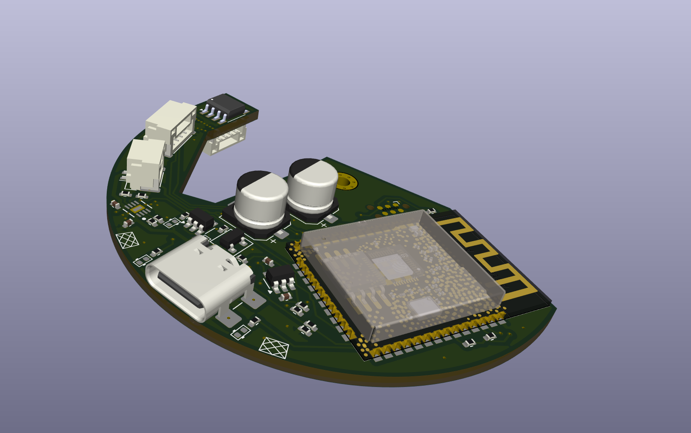

# 🖱️ High-Resolution Scroll Wheel

> A large, high-resolution scroll wheel inspired by [Engineer Bo](https://www.patreon.com/c/engineerbo/posts)'s [YouTube video](https://www.youtube.com/watch?v=FSy9G6bNuKA).

---

> ⚠️ **Early Development Phase**  
> This project is still under development. Use at your own risk.

---

## 📅 Roadmap

- [X] BLE HID Support
- [ ] Mouse Wheel Click Functionality
- [ ] Automatic power off
- [ ] Battery Level tuning
- [ ] Enclosure refinements
- [ ] Scroll acceleration modes

---

## 🔧 Hardware Overview

- **Main Controller:** ESP32 (subject to maybe change later)
- **Magnetic Encoder:** [AS5600](https://ams-osram.com/products/sensor-solutions/position-sensors/ams-as5600-position-sensor)
- **Battery Pack:** S3P2 NiMH Eneloop cells

---

## 💻 Software Architecture

The entire functionality is now handled by a single **ESP32 microcontroller** using **BLE HID** (Human Interface Device) mode.

- The scroll wheel inputs are directly interpreted by the ESP32.
- Input data (e.g. rotation) is sent over **Bluetooth Low Energy** as **HID events**, emulating a native scroll device.
- No additional driver or software is needed on the PC — it works like a standard Bluetooth mouse/scroll input.

> ✅ This simplifies the setup significantly and increases compatibility across Linux, Windows, and macOS.

---

## 🧩 Required Components

| Part                             | Quantity |
|----------------------------------|----------|
| Main PCB (pre-soldered)          | 1        |
| Bearing (65×85×10 mm)            | 1        |
| JST GH Cable Kit                 | 1 set    |
| Cylinder Magnets (3×12 mm)       | 7        |
| 3D-Printed Parts                 | 3        |
| S3P2 NiMH Battery Pack           | 1        |
| M2×5 Screws                      | 5        |

---

## 🛠️ Build Guide

### 🔄 Bearing Preparation

Factory bearings may feel stiff due to thick grease. Here's how to optimize smoothness:

1. Remove both sealing rings.
2. Soak the bearing in **isopropyl alcohol** (or another grease remover).
3. Scrub out all remaining grease.
4. Let it dry for ~3 hours.
5. Reinstall **one** sealing ring.
6. Add **light machine oil** generously into the bearing.
7. Reinstall the **second** sealing ring.
8. Spin the bearing multiple times to distribute the oil.
9. *(Optional)* Remove the seals again for an even smoother feel (at the cost of dust protection).

---

## 🚧 Development Gallery

### 🔌 First PCB Prototype (with known bugs)

---

### 🧱 PCB Inside the Case

---

### 🧪 First Firmware Test (External ESP32)

---

### 🧰 Fully Assembled PCB

---

### 🆕 PCB V2 – Improved & Debugged

---

## 🤝 Contributing

Pull requests, suggestions, and feedback are always welcome — feel free to get involved and help improve the project!  
Prototyping and hardware development can get expensive quickly, so if you’d like to support the project financially:

&nbsp;

Every bit helps keep the ideas (and soldering irons) running!
