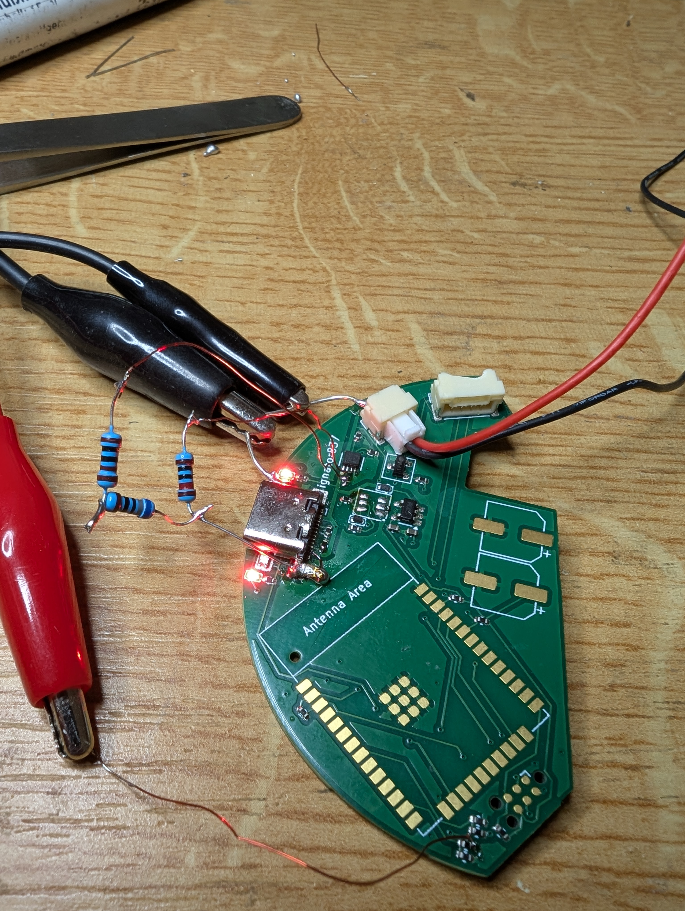
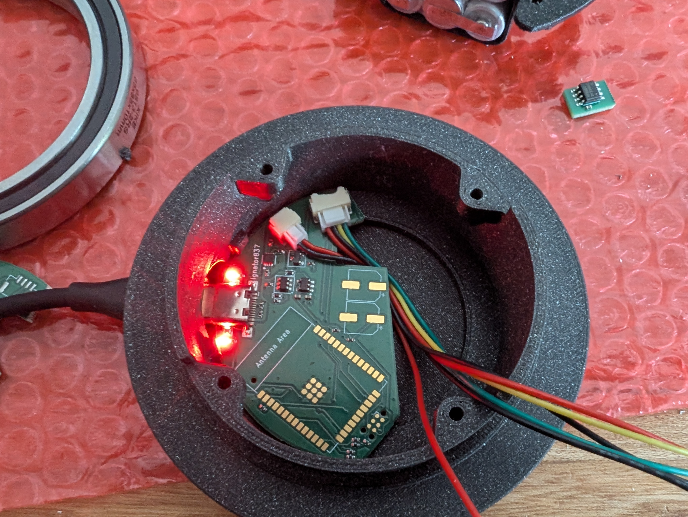
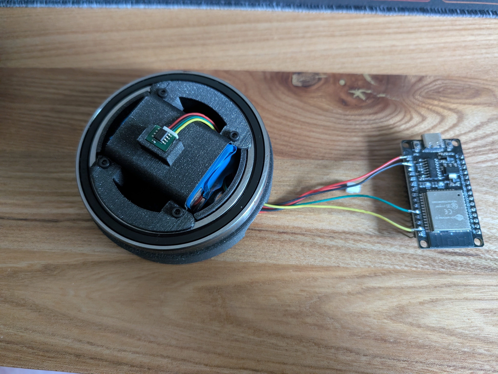
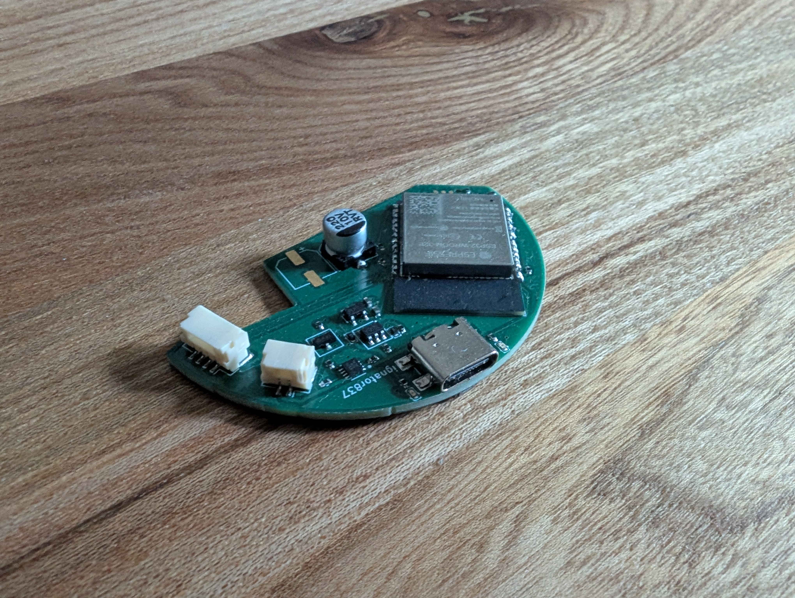

# Scroll-Wheel
A big high resolution Scroll wheel inspired by [Engineer Bo](https://www.patreon.com/c/engineerbo/posts)'s [Youtube Video](https://www.youtube.com/watch?v=FSy9G6bNuKA)

# This Project is still in an Early Development Phase, use with caution

## Hardware

The main controller is a ESP32 (For now)

As Magnetic encoder I am using a [AS5600](https://ams-osram.com/products/sensor-solutions/position-sensors/ams-as5600-position-sensor)

The Battery Pack is a NiMh S3P2 Pack of Eneloops

## Software

The Software is made of two parts, the Firmware on the ESP and a Driver for the pc (Linux only) written in Python

The communication is done via a BLE uart connection (I hope I will be able to get a BLE HID interface running soon)

## Required Parts

1. Main PCB (with all components presoldered
2. Bearing 65x85x10mm
3. JST GH Cable kit
4. 7x 3x12mm Cylinder Magnets
5. 3D Printed Parts
6. S3P2 NiMh Battery Pack
7. 5x M2x5 Screws

## Build

### Preparing the Bearing

Most of the Bearings Don't run Smooth enouth at Factory default. To fix this, we are going to remove the grease in the Bearing and replace it with oil.

1. Remove both bearing sealing Rings
2. Soak the Bearing in Isopropanol (or any other Greas removing substance)
3. Scrub out all of the Grease from the Bearing
4. Let the Bearing dry for about 3 Hours
5. Put one of the sealing rings back in place
6. Put a bunch of Oil inside the bearing
7. Push the Second Sealing ring back in place
8. Give the bearing a bunch of good spinns, to spread out the Oil
9. (Optional) Take the Seals back out, for a smoother spin

## Development Progress

Here you can see the First PCB-prototype, with a bunch of Bugs

Here is the Prototype PCB in the Case

Here I am testing the First Firmware version with an external ESP32

Here is a Picture of the Fully asmblied PCB

This is the PCB V2 with lots of improvements and Bugfixes

